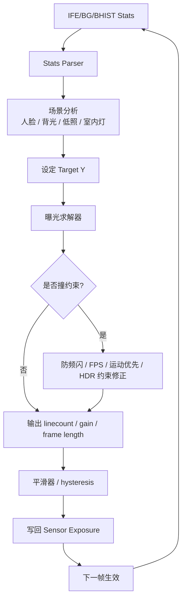
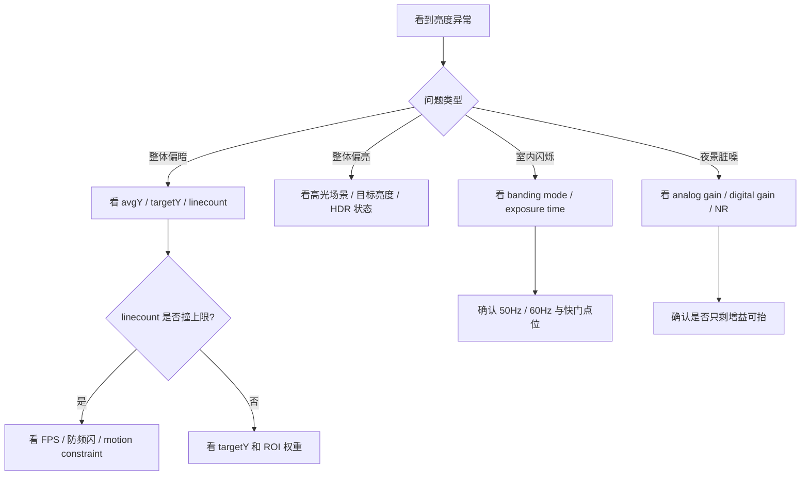

# AE（自动曝光）学习指南

AE（Auto Exposure）负责让画面亮度“合适且稳定”。它不是简单地把图像调亮，而是在亮度、噪声、拖影、帧率和频闪之间做平衡。

## 目录

1. [AE 基础概念](#ae-基础概念)
2. [手机 AE 的典型输入与输出](#手机-ae-的典型输入与输出)
3. [AE 运行流程](#ae-运行流程)
4. [常见 AE 策略](#常见-ae-策略)
5. [详细流程图](#详细流程图)
6. [调试时重点看什么](#调试时重点看什么)
7. [平台源码结合](#平台源码结合)
8. [图片目录](#图片目录)
9. [实操练习](#实操练习)

## AE 基础概念

### AE 在解决什么问题

AE 主要解决下面几个问题：

- 场景太暗时怎么把亮度拉起来
- 场景太亮时怎么避免高光过曝
- 亮度变化时怎么收敛得既快又稳
- 室内灯下怎么避免频闪

### 影响曝光的几个核心量

| 参数 | 作用 | 常见副作用 |
|---|---|---|
| `Exposure Time / Linecount` | 直接提高进光量 | 太长会拖影，视频里还受帧率限制 |
| `Analog Gain` | 提高传感器输出亮度 | 噪声增大 |
| `Digital Gain` | 后级补亮 | 更容易把噪声一起放大 |
| `Frame Length / FPS` | 控制帧率和曝光上限 | 录像场景约束更明显 |

### 手机 AE 的目标

- 主体亮度不要明显偏暗或偏亮
- 亮度变化尽量平滑
- 不要为了变亮把噪声拉得太夸张
- 兼顾运动模糊和防频闪

## 手机 AE 的典型输入与输出

### 输入

- ISP 亮度统计
- 分区亮度或直方图
- 人脸或触摸测光 ROI
- 当前模式：预览、录像、拍照、HDR、闪光灯
- Sensor 约束：最短/最长曝光、最大增益、帧率边界

### 输出

- `linecount`
- `sensor gain`
- `digital gain`
- `frame length`
- 某些平台上还会有 `lux index`、`exp index` 这类中间控制量

## AE 运行流程

### 1. 获取统计值

AE 一般会先拿到以下统计信息：

- 全局平均亮度
- 分块亮度
- 亮度直方图
- ROI 区域亮度

### 2. 判断当前场景

AE 不会把所有场景都当成同一种情况处理，典型会区分：

- 普通场景
- 逆光场景
- 人脸场景
- 夜景或低照场景
- 室内频闪场景

### 3. 设定目标亮度

目标亮度不一定固定。比如：

- 人脸场景更看重脸部亮度
- 夜景会适当容忍整体稍暗
- 逆光时要在主体和背景之间折中

### 4. 分配曝光组合

常见思路是：

1. 尽量先调整曝光时间
2. 曝光时间受限后再提高模拟增益
3. 最后才依赖数字增益

但这一步常常会被下面几个条件限制：

- 视频模式不允许慢门太长
- 防频闪限制快门要落在安全点
- 运动场景需要优先保快门

### 5. 做平滑和收敛控制

AE 不会每帧都暴力跳到目标值，否则用户会明显看到亮度忽闪。常见做法包括：

- 帧间平滑
- 快速场景切换时加快收敛
- 收敛后减小抖动

## 常见 AE 策略

### 测光模式

| 模式 | 特点 | 适用场景 |
|---|---|---|
| 平均测光 | 最稳，简单 | 普通场景 |
| 中心加权 | 更关注中心主体 | 日常拍摄 |
| 点测光 | 对局部非常敏感 | 逆光人物、舞台光 |
| 人脸测光 | 以人脸亮度为主 | 自拍、人像 |

### 防频闪

室内灯源常和市电频率相关，所以 AE 常会把曝光时间锁在类似下面的值附近：

- `1/100s`、`1/50s`
- `1/120s`、`1/60s`

这样做的好处是更稳定，但副作用是：

- 某些场景快门不能自由拉长
- 亮度不够时只能通过增益继续补

## 详细流程图

### AE 控制闭环



### AE 调试判断图



## 调试时重点看什么

| 参数 | 看什么 |
|---|---|
| `avgY` / `luma` | 当前亮度和肉眼感受是否一致 |
| `targetY` | 目标亮度是否设得过高或过低 |
| `linecount` | 曝光时间是否撞到限制 |
| `gain` | 是否因为补亮过度导致噪声明显 |
| `lux index` | 场景亮度切换时是否平滑 |
| `banding mode` | 是否处在防频闪模式下 |
| `ROI weight` | 人脸或触摸测光是否真正生效 |

### 一个便于理解的伪日志

```text
frame=120 avgY=43 targetY=58 linecount=820 gain=2.1 lux=210
frame=121 avgY=48 targetY=58 linecount=920 gain=2.1 lux=205
frame=122 avgY=54 targetY=58 linecount=1000 gain=2.2 lux=201
frame=123 avgY=57 targetY=58 linecount=1000 gain=2.2 lux=199
```

从这段日志可以读到：

- 画面一开始偏暗
- AE 主要先拉长曝光时间
- 亮度逐步逼近目标值
- 增益只做了少量补偿

## 平台源码结合

如果你手头是高通平台，建议把这部分和 [QCOM/README.md](../QCOM/README.md) 一起看。不同 BSP 命名会有差异，但职责通常能一一对上。

### 建议优先搜索的关键词

- `AEC`
- `AEStats`
- `Exposure`
- `LuxIndex`
- `Banding`
- `StatsParser`
- `SensorExposure`

### 你在源码里通常要找的三段逻辑

1. 统计数据从 ISP 到 AE 的入口
2. AE 算法根据统计做决策
3. 曝光参数如何回写到 Sensor 驱动

### 高通平台建议先看的目录

常见商业 BSP 路径通常长这样：

```text
vendor/qcom/proprietary/camx/
vendor/qcom/proprietary/chi-cdk/
```

在这些目录里，AE 相关最值得先找的是：

- `statsparser`：统计值进入 AEC 前的整理
- `aec` 或 `stats` 相关目录：目标亮度、曝光求解、收敛和平滑
- `sensor` 相关目录：exposure setting 下发
- `node` / `pipeline` / `session`：请求是在哪一层串起来的

### 高通源码阅读顺序

1. 先从 `ProcessCaptureRequest` 一类入口看请求是怎么进来的。
2. 再跟到 `stats parser` 看 AE 拿到的统计长什么样。
3. 再看 AEC 决策如何输出 `linecount / gain`。
4. 最后看 sensor driver 或 sensor node 是如何真正把曝光写下去的。

### 一段典型伪代码

```cpp
void RunAEC(const AEStats& stats) {
    SceneInfo scene = AnalyzeScene(stats);
    TargetY target = ComputeTarget(scene);
    ExposureDecision exp = SolveExposure(target, sensorLimit, bandingMode);
    ApplyExposureToSensor(exp);
}
```

### 如果后面接入高通或 Android 相机栈源码

优先去对照下面这些职责：

- `stats parser`：统计值是怎么整理出来的
- `AEC algo`：目标亮度和曝光组合怎么求
- `sensor setting apply`：linecount / gain 最终怎么下发

## 图片目录

AE 相关图片建议放在 [images/README.md](./images/README.md) 和 [images/flowcharts.md](./images/flowcharts.md) 中统一管理，推荐命名：

- `ae-pipeline.png`
- `ae-banding-case.png`
- `ae-debug-checklist.png`
- `ae-log-example.png`

## 实操练习

### 练习 1：观察不同光照下的快门和 ISO

步骤：

1. 用手机专业模式拍一张室外日光照片。
2. 再拍一张室内暖光照片。
3. 记录两次的快门和 ISO。

重点观察：

- 室内是不是更依赖慢门和高 ISO
- 亮度提升主要靠快门还是靠增益

### 练习 2：验证防频闪约束

步骤：

1. 在室内 LED 灯下打开预览。
2. 观察快门是否经常停在 `1/100s` 或 `1/120s` 一类值上。
3. 换一个灯区，再看是否变化。

### 练习 3：逆光人像测光实验

步骤：

1. 让人物站在窗前。
2. 默认模式拍一张。
3. 点击人脸或主体区域再拍一张。

思考：

- AE 是优先保背景，还是优先保人脸
- 两张图的取舍差异来自什么策略

### 练习 4：做一份 AE 调试记录

| 项目 | 示例 |
|---|---|
| 场景 | 室内办公区，顶灯 |
| 现象 | 预览偏暗，偶发闪烁 |
| 快门 | 1/100s |
| ISO | 1250 |
| 初步推测 | 防频闪限制导致快门受限，只能抬增益 |
| 验证方法 | 移到自然光更强区域继续拍摄 |
