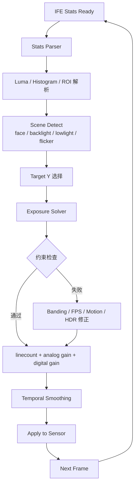
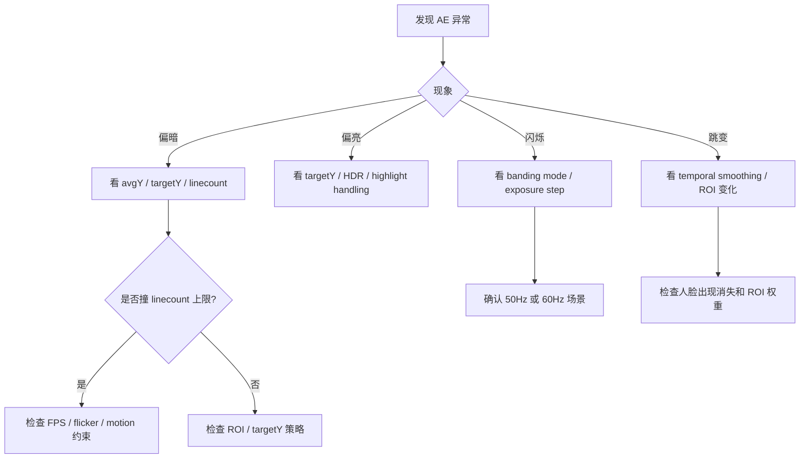

# AE Flowcharts

## AE 曝光控制主流程

```mermaid
flowchart TD
    A["IFE Stats Ready"] --> B["Stats Parser"]
    B --> C["Luma / Histogram / ROI 解析"]
    C --> D["Scene Detect<br/>face / backlight / lowlight / flicker"]
    D --> E["Target Y 选择"]
    E --> F["Exposure Solver"]
    F --> G{"约束检查"}
    G -->|通过| H["linecount + analog gain + digital gain"]
    G -->|失败| I["Banding / FPS / Motion / HDR 修正"]
    I --> H
    H --> J["Temporal Smoothing"]
    J --> K["Apply to Sensor"]
    K --> L["Next Frame"]
    L --> A
```

## AE 亮度问题排查

```mermaid
flowchart TD
    A["发现 AE 异常"] --> B{"现象"}
    B -->|偏暗| C["看 avgY / targetY / linecount"]
    B -->|偏亮| D["看 targetY / HDR / highlight handling"]
    B -->|闪烁| E["看 banding mode / exposure step"]
    B -->|跳变| F["看 temporal smoothing / ROI 变化"]
    C --> G{"是否撞 linecount 上限?"}
    G -->|是| H["检查 FPS / flicker / motion 约束"]
    G -->|否| I["检查 ROI / targetY 策略"]
    E --> J["确认 50Hz 或 60Hz 场景"]
    F --> K["检查人脸出现消失和 ROI 权重"]
```
