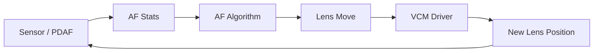
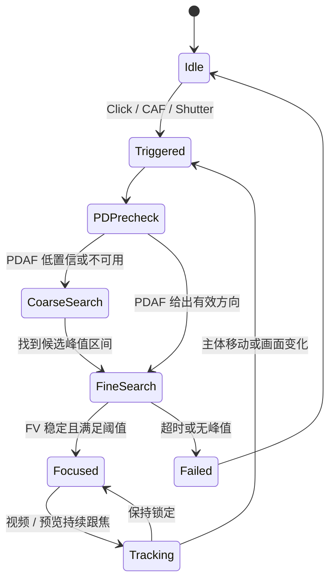
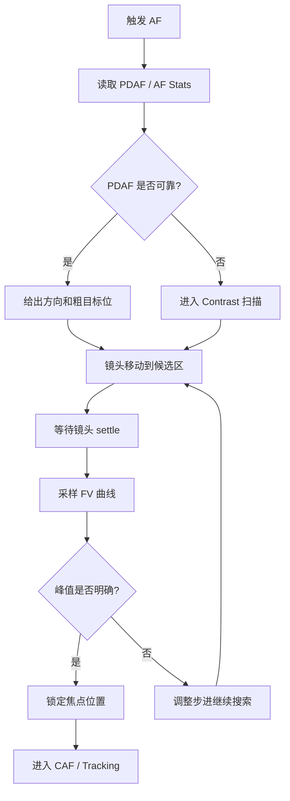

# AF（自动对焦）学习指南

AF（Auto Focus）负责让主体尽快落在清晰位置。对手机来说，重点不只是“能合焦”，还包括“合得快、合得稳、不要反复抽动”。

## 目录

1. [AF 基础概念](#af-基础概念)
2. [手机 AF 的典型系统组成](#手机-af-的典型系统组成)
3. [常见 AF 技术路线](#常见-af-技术路线)
4. [AF 工作流程](#af-工作流程)
5. [详细流程图](#详细流程图)
6. [调试时重点看什么](#调试时重点看什么)
7. [平台源码结合](#平台源码结合)
8. [图片目录](#图片目录)
9. [实操练习](#实操练习)

## AF 基础概念

### 什么是对焦

对焦本质上是移动镜头，让目标物体在传感器上成像最清晰。

### 和 AF 强相关的几个概念

| 概念 | 说明 |
|---|---|
| 焦平面 | 当前最清晰的平面 |
| 景深 `DOF` | 看起来还算清晰的前后范围 |
| 镜头位置 `Lens Position / DAC` | 当前镜头所处的焦段位置 |
| 对焦评价值 `FV` | 当前画面清晰度量化结果 |

### 手机 AF 为什么难

- 模组小，装配和标定影响明显
- 低照和低纹理场景下评价值不稳定
- 运动物体会让焦点持续变化
- 视频场景既要清晰，也要避免拉风箱

## 手机 AF 的典型系统组成

### 硬件部分

| 组件 | 作用 |
|---|---|
| VCM | 驱动镜头移动 |
| 驱动 IC | 控制马达动作 |
| 霍尔传感器 | 反馈镜头位置 |
| 图像传感器 | 提供清晰度或相位信息 |
| PDAF 像素 | 提供对焦方向和距离线索 |

### 软件部分



## 常见 AF 技术路线

### Contrast AF

根据图像清晰度评价值寻找峰值。

优点：

- 不依赖特殊硬件
- 理论上能找到清晰峰值

缺点：

- 需要搜索
- 速度偏慢
- 容易来回拉

### PDAF

通过相位差信息判断应该往哪边走、走多远。

优点：

- 速度快
- 更适合连续跟焦

缺点：

- 对光照和纹理敏感
- 需要做置信度判断

### Hybrid AF

手机里更常见的是混合方案：

- 先用 PDAF 快速靠近焦点
- 再用 Contrast AF 做最后精调

## AF 工作流程

### 1. 触发

触发来源可能包括：

- 点击对焦
- 半按快门
- 连续自动对焦 `CAF`
- 模式切换后的重新搜索

### 2. 粗搜索

如果有 PDAF，会先用相位信息快速估计方向；如果没有，只能做步进搜索。

### 3. 细搜索

在候选焦点附近做更小步进，找到清晰峰值。

### 4. 合焦判定

常见依据包括：

- `FV` 到达峰值附近
- PDAF 置信度足够
- 连续多帧稳定
- 镜头位置和评价值不再明显变化

### 5. 跟踪

对视频和预览来说，AF 不是合上一次就结束，还要持续判断：

- 主体有没有移动
- 是否要重新触发
- 重触发会不会影响观看体验

## 详细流程图

### AF 状态机



### AF 搜索与执行流



## 调试时重点看什么

| 参数 | 重点观察 |
|---|---|
| `lens position / DAC` | 镜头是否撞边界，是否真的走到了目标位 |
| `FV` | 清晰度曲线是否有明显峰值 |
| `PDAF confidence` | 当前相位信息是否可靠 |
| `scan step` | 搜索步进是否过大或过小 |
| `settle time` | 镜头动作后是否给了足够稳定时间 |
| `AF state` | 是否在 searching / focused / fail 之间异常切换 |

### 常见问题定位顺序

1. 算法是否判断对了方向
2. 镜头是否真的走到了目标位置
3. 评价值或 PDAF 是否足够可靠
4. 状态机是否反复重触发

## 平台源码结合

如果你手头是高通平台，建议把这部分和 [QCOM/README.md](../QCOM/README.md) 一起对着看，尤其是从 HAL 请求入口一路跟到 actuator 和 PDAF 解析。

### 建议优先搜索的关键词

- `AF`
- `AFStats`
- `FocusValue`
- `PDAF`
- `LensPosition`
- `MoveLens`
- `CAF`
- `PDLib`

### 源码里常见的三段职责

1. 统计或相位信息的获取
2. AF 状态机和搜索决策
3. 镜头驱动控制和位置反馈

### 高通平台建议先看的目录

常见商业 BSP 路径通常长这样：

```text
vendor/qcom/proprietary/camx/
vendor/qcom/proprietary/chi-cdk/
```

AF 重点建议优先看：

- `pdaf` / `af` / `statsparser`：PDAF 数据和 FV 统计怎么组织
- `actuator`：镜头位置如何下发
- `session` / `pipeline` / `node`：AF 结果在哪一层参与请求
- `chi override`：某些项目会在这里挂业务策略

### 高通源码阅读顺序

1. 找 HAL/CHI 里请求进入的入口函数。
2. 找 AF state machine 和 PDAF parser。
3. 找 actuator driver 或 lens move 控制点。
4. 最后结合 log 看 `lens position / FV / confidence` 的变化。

### 一段典型伪代码

```cpp
void RunAF(const AFStats& stats, const PDAFInfo& pd) {
    FocusHint hint = EstimateFocusDirection(pd, stats);
    LensTarget target = SearchBestPosition(hint, stats);
    MoveLensTo(target);
    UpdateAFState(target, stats);
}
```

### 后续接入平台源码时建议对照

- `AF state machine`
- `PDAF parser`
- `lens actuator driver`
- `CAF trigger condition`

## 图片目录

AF 相关图片建议放在 [images/README.md](./images/README.md) 和 [images/flowcharts.md](./images/flowcharts.md) 中统一管理，推荐命名：

- `af-state-machine.png`
- `af-search-curve.png`
- `af-pdaf-flow.png`
- `af-fail-case.png`

## 实操练习

### 练习 1：近景和远景切换

步骤：

1. 先对准近物体点击对焦。
2. 再对准远景点击对焦。
3. 观察画面变清晰前的响应速度和动作幅度。

### 练习 2：低纹理场景测试

步骤：

1. 先对纯色墙面点击对焦。
2. 再对一张印有文字的纸点击对焦。
3. 比较两次成功率和等待时间。

### 练习 3：移动主体跟焦

步骤：

1. 让同伴从远处慢慢走近。
2. 开启录像观察是否持续合焦。
3. 记录最容易失焦的距离或速度。

### 练习 4：做一份 AF 观察记录

| 项目 | 示例 |
|---|---|
| 场景 | 室内低照，打印纸文字 |
| 现象 | 第二次点击对焦明显犹豫 |
| 初步推测 | 光照不足，评价值波动大 |
| 验证方法 | 打开台灯后再次测试 |
| 结果 | 对焦速度提升，拉风箱减少 |
