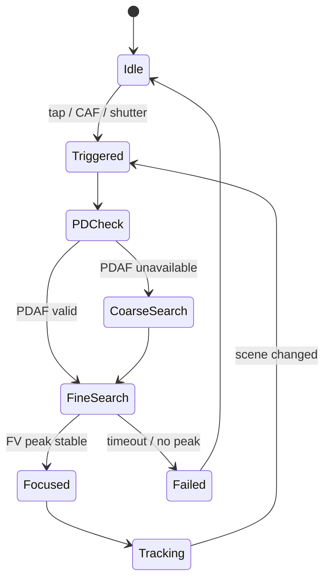
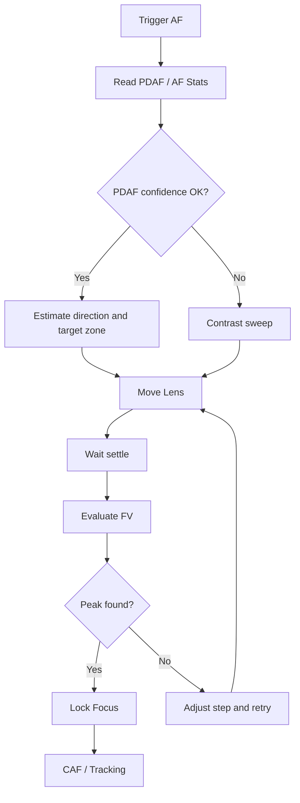

# AF Flowcharts

## AF 状态机

```mermaid
stateDiagram-v2
    [*] --> Idle
    Idle --> Triggered: tap / CAF / shutter
    Triggered --> PDCheck
    PDCheck --> CoarseSearch: PDAF unavailable
    PDCheck --> FineSearch: PDAF valid
    CoarseSearch --> FineSearch
    FineSearch --> Focused: FV peak stable
    FineSearch --> Failed: timeout / no peak
    Focused --> Tracking
    Tracking --> Triggered: scene changed
    Failed --> Idle
```

## AF 搜索执行流

```mermaid
flowchart TD
    A["Trigger AF"] --> B["Read PDAF / AF Stats"]
    B --> C{"PDAF confidence OK?"}
    C -->|Yes| D["Estimate direction and target zone"]
    C -->|No| E["Contrast sweep"]
    D --> F["Move Lens"]
    E --> F
    F --> G["Wait settle"]
    G --> H["Evaluate FV"]
    H --> I{"Peak found?"}
    I -->|Yes| J["Lock Focus"]
    I -->|No| K["Adjust step and retry"]
    K --> F
    J --> L["CAF / Tracking"]
```
