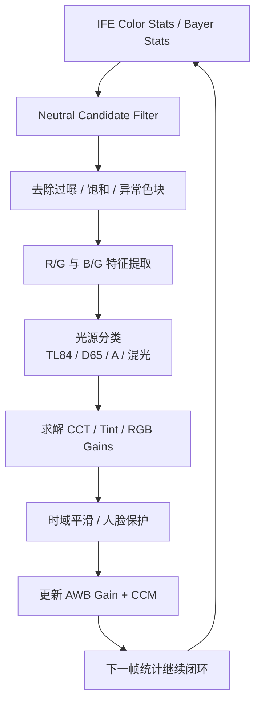
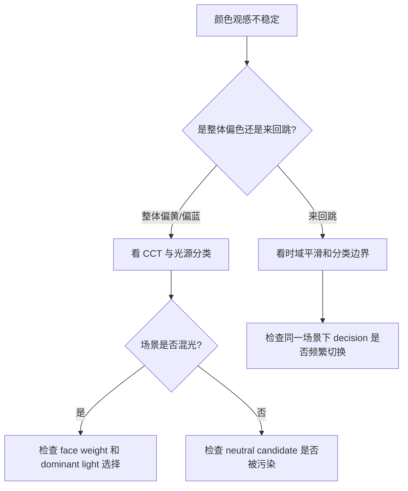

# AWB（自动白平衡）学习指南

AWB（Auto White Balance）负责让颜色看起来更合理。对用户最直观的体验就是：白色物体白不白，肤色自然不自然，画面会不会忽冷忽暖地跳。

## 目录

1. [AWB 基础概念](#awb-基础概念)
2. [手机 AWB 的典型输入与输出](#手机-awb-的典型输入与输出)
3. [AWB 的核心流程](#awb-的核心流程)
4. [常见 AWB 算法思路](#常见-awb-算法思路)
5. [详细流程图](#详细流程图)
6. [调试时重点看什么](#调试时重点看什么)
7. [平台源码结合](#平台源码结合)
8. [图片目录](#图片目录)
9. [实操练习](#实操练习)

## AWB 基础概念

### AWB 在解决什么问题

不同光源颜色不同：

- 白炽灯偏暖
- 阴影偏冷
- 荧光灯可能偏绿

AWB 的任务就是估计当前光源，并输出合适的颜色增益，让图像颜色更接近人眼认知。

### 两个必须先掌握的量

| 概念 | 含义 |
|---|---|
| `CCT` | 相关色温，决定整体偏冷还是偏暖 |
| `Tint` | 绿色或洋红方向的偏移 |

### 常见光源色温范围

| 光源 | 色温范围（K） | 常见观感 |
|---|---|---|
| 烛光 | 1500 - 2000 | 很暖，偏红橙 |
| 白炽灯 | 2500 - 3500 | 偏黄 |
| 荧光灯 | 4000 - 5000 | 可能偏绿 |
| 日光 | 5500 - 6500 | 相对中性 |
| 阴天 | 6500 - 7500 | 偏冷 |
| 阴影 | 7500 - 8500 | 更偏蓝 |

## 手机 AWB 的典型输入与输出

### 输入

- ISP RGB 统计
- 分块颜色统计
- 白点候选区域
- 人脸或肤色区域信息
- 历史帧 AWB 结果
- 场景分类信息

### 输出

- `R gain`
- `G gain`
- `B gain`
- `CCT`
- `Tint`
- 某些平台还会输出光源分类结果

## AWB 的核心流程

### 1. 获取颜色统计

常见形式有：

- 全局 RGB 统计
- 分块 RGB 统计
- 白点候选点统计

### 2. 过滤无效区域

为了避免误判，AWB 往往会过滤：

- 过曝区域
- 大面积纯色区域
- 饱和颜色块
- 非典型光源区域

### 3. 判断候选光源

通常会根据 `R/G` 和 `B/G` 比值推断当前更像：

- 白炽灯
- 荧光灯
- 日光
- 阴影
- 混合光源

### 4. 计算 RGB 增益

AWB 的核心输出就是一组颜色补偿增益，用来把当前图像拉回更中性的方向。

### 5. 做时域稳定

如果 AWB 每帧都大幅变化，用户会明显看到颜色闪动。所以实际策略里经常会有：

- 帧间平滑
- 场景切换保护
- 人脸优先保护

## 常见 AWB 算法思路

### Gray World

假设整幅图像平均颜色应接近中性灰。

优点：

- 简单
- 适合入门理解

缺点：

- 大面积单色场景容易误判

### White Patch

寻找场景中的白点或高亮中性色区域。

优点：

- 场景里有白色物体时直观有效

缺点：

- “最亮”不一定真的“最白”

### 场景先验和分类法

现代手机常见做法是把统计和先验结合：

- 室内和室外策略不同
- 有人脸时会更重视肤色
- 混光时会优先稳定，而不是绝对中性

## 详细流程图

### AWB 决策闭环



### 混光场景判断图



## 调试时重点看什么

| 参数 | 重点观察 |
|---|---|
| `R/G`, `B/G` | 是否落在合理光源区域 |
| `CCT` | 估计色温是否符合场景 |
| `Tint` | 是否有明显绿偏或洋红偏 |
| `AWB gains` | 增益是否异常跳变 |
| `decision` | 光源分类是否频繁切换 |
| `face weight` | 人像场景下人脸保护是否生效 |

### 常见现象怎么拆

看到“偏黄”时，可以继续问自己：

1. 当前环境本来就是暖光，还是算法真的判断错了
2. `CCT` 是不是估得太低
3. `Tint` 有没有额外偏移
4. 是 AWB 问题，还是后续 `CCM / tone mapping` 让观感更暖

## 平台源码结合

如果你后面接的是高通平台，建议把这部分和 [QCOM/README.md](../QCOM/README.md) 里的 stats -> 3A -> color pipeline 链路一起看。

### 建议优先搜索的关键词

- `AWB`
- `AWBStats`
- `RG BG`
- `CCT`
- `Tint`
- `AWBGain`
- `CCM`
- `LightSource`

### 源码里常见的三段职责

1. RGB 统计和候选点过滤
2. 光源分类和 CCT 估计
3. 增益输出和颜色链路联动

### 高通平台建议先看的目录

常见商业 BSP 路径通常长这样：

```text
vendor/qcom/proprietary/camx/
vendor/qcom/proprietary/chi-cdk/
```

AWB 最值得先对照的是：

- `statsparser`：RGB / Bayer 统计的整理
- `awb` / `stats` / `algorithms`：light source decision 和 gain 计算
- `ccm` / `color` 相关目录：AWB 输出怎么传给颜色链路
- `chi override`：项目自定义肤色或场景策略

### 一段典型伪代码

```cpp
void RunAWB(const RGBStats& stats) {
    CandidateSet cands = FilterNeutralCandidates(stats);
    LightSource light = EstimateLightSource(cands);
    AWBDecision decision = SolveAWBGain(light, cands);
    UpdateColorPipeline(decision);
}
```

### 后续接入源码时建议重点对照

- `AWB stats parser`
- `light source classifier`
- `gain / CCT decision`
- `CCM update`

## 图片目录

AWB 相关图片建议放在 [images/README.md](./images/README.md) 和 [images/flowcharts.md](./images/flowcharts.md) 中统一管理，推荐命名：

- `awb-pipeline.png`
- `awb-light-source-map.png`
- `awb-mixed-light-case.png`
- `awb-debug-sheet.png`

## 实操练习

### 练习 1：白纸在不同光源下的变化

步骤：

1. 准备一张白纸。
2. 分别在日光、室内暖光、阴影下拍摄。
3. 对比三张图中白纸的观感差异。

### 练习 2：混光场景观察

步骤：

1. 站在窗边，同时让室内灯保持开启。
2. 拍一张包含白纸或人脸的照片。
3. 稍微改变拍摄角度，再拍一张。

重点观察：

- 颜色有没有明显忽冷忽暖地变化
- 相机是更偏向室外光还是室内光

### 练习 3：肤色稳定性测试

步骤：

1. 在室内暖光和窗边各拍一张人物照片。
2. 对比肤色是否稳定、是否偏黄或偏青。
3. 记录哪类场景更容易出问题。

### 练习 4：做一份 AWB 观察记录

| 项目 | 示例 |
|---|---|
| 场景 | 室内餐厅，暖黄灯 |
| 现象 | 白盘子偏黄，肤色偏暖 |
| 初步判断 | 环境偏暖，AWB 选择保留了一部分氛围色 |
| 进一步验证 | 换到窗边自然光环境继续拍摄 |
| 结论 | 颜色是否“正确”需要结合场景目标判断 |
