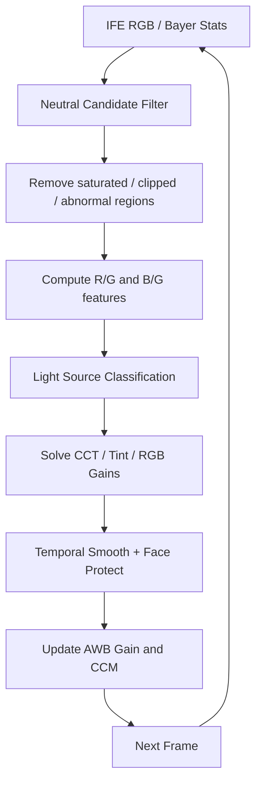
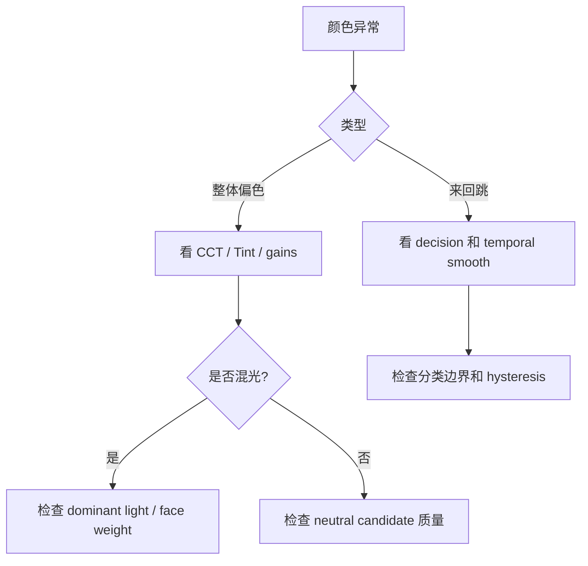

# AWB Flowcharts

## AWB 估计流程

```mermaid
flowchart TD
    A["IFE RGB / Bayer Stats"] --> B["Neutral Candidate Filter"]
    B --> C["Remove saturated / clipped / abnormal regions"]
    C --> D["Compute R/G and B/G features"]
    D --> E["Light Source Classification"]
    E --> F["Solve CCT / Tint / RGB Gains"]
    F --> G["Temporal Smooth + Face Protect"]
    G --> H["Update AWB Gain and CCM"]
    H --> I["Next Frame"]
    I --> A
```

## 混光问题定位

```mermaid
flowchart TD
    A["颜色异常"] --> B{"类型"}
    B -->|整体偏色| C["看 CCT / Tint / gains"]
    B -->|来回跳| D["看 decision 和 temporal smooth"]
    C --> E{"是否混光?"}
    E -->|是| F["检查 dominant light / face weight"]
    E -->|否| G["检查 neutral candidate 质量"]
    D --> H["检查分类边界和 hysteresis"]
```
