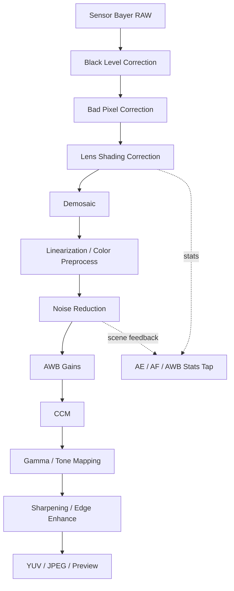
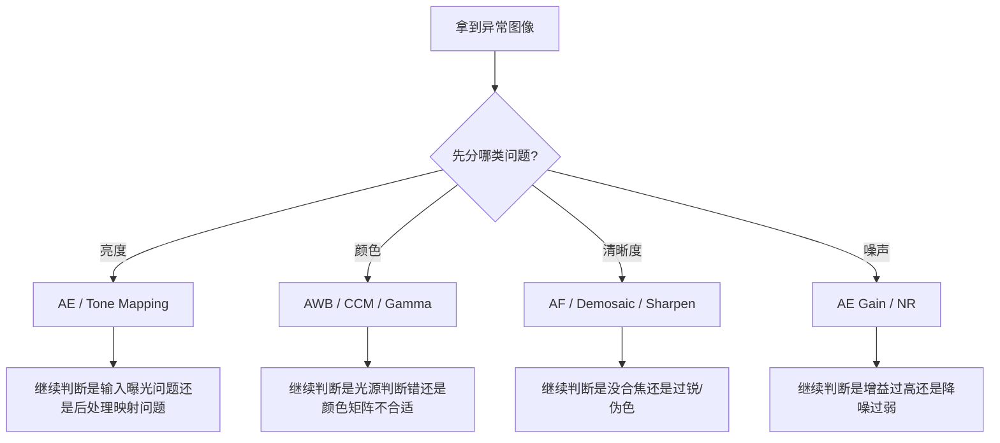

# ISP（图像信号处理器）学习指南

ISP（Image Signal Processor）负责把 Sensor 输出的 RAW 数据处理成用户最终看到的图像。理解 ISP，能帮助你把很多“画质问题”拆成一个个具体模块问题。

## 目录

1. [ISP 概述](#isp-概述)
2. [ISP 和 3A 的关系](#isp-和-3a-的关系)
3. [典型 ISP 处理流程](#典型-isp-处理流程)
4. [核心模块速览](#核心模块速览)
5. [详细流程图](#详细流程图)
6. [调试时重点看什么](#调试时重点看什么)
7. [平台源码结合](#平台源码结合)
8. [图片目录](#图片目录)
9. [实操练习](#实操练习)

## ISP 概述

### ISP 在解决什么问题

传感器直接输出的 RAW 数据并不能直接给用户看，它还存在：

- 黑电平偏移
- 噪声
- 镜头暗角和颜色不均
- Bayer 格式无法直接显示
- 颜色和对比度不适合直接输出

ISP 的任务，就是把这些问题一步步处理掉。

## ISP 和 3A 的关系

3A 和 ISP 在系统里是联动的：

- ISP 提供统计信息给 `AE / AF / AWB`
- `AE` 影响曝光输入
- `AF` 影响清晰度基础
- `AWB` 影响颜色校正方向

所以很多问题不能只盯着 ISP，看图像问题时也要回头看 3A。

## 典型 ISP 处理流程

下面是一条便于学习的简化链路，不同平台的顺序会有差异，但总体思路接近：

```mermaid
flowchart LR
    A["RAW"] --> B["Black Level Correction"]
    B --> C["Bad Pixel Correction"]
    C --> D["Lens Shading Correction"]
    D --> E["Demosaic"]
    E --> F["Noise Reduction"]
    F --> G["AWB Gains"]
    G --> H["CCM"]
    H --> I["Gamma / Tone Mapping"]
    I --> J["Sharpening"]
    J --> K["YUV / JPEG"]
```



## 核心模块速览

### Black Level Correction

作用：

- 修正黑电平偏移

异常现象：

- 黑位发灰
- 暗部不干净

### Bad Pixel Correction

作用：

- 修复坏点、热像素等异常像素

异常现象：

- 固定亮点或暗点

### Lens Shading Correction

作用：

- 修正边缘暗角和颜色不均

异常现象：

- 四角发暗
- 边缘偏色

### Demosaic

作用：

- 把 Bayer RAW 重建成完整彩色图像

异常现象：

- 彩边
- 伪色
- 细纹理异常

### Noise Reduction

作用：

- 降低亮度噪声和色彩噪声

异常现象：

- 太弱：噪点多
- 太强：细节糊、塑料感重

### AWB Gains 与 CCM

作用：

- 调整白平衡
- 做颜色校正

异常现象：

- 整体偏色
- 肤色不自然

### Gamma 与 Tone Mapping

作用：

- 调整亮度映射和对比度

异常现象：

- 高光死白
- 暗部发闷
- 整体层次不自然

### Sharpening

作用：

- 提升清晰感

异常现象：

- 过锐
- 边缘白边
- 假细节多

## 详细流程图

### ISP 全链路



### ISP 问题定位图



## 调试时重点看什么

| 现象 | 优先怀疑模块 |
|---|---|
| 四角暗 | `LSC` |
| 夜景噪点多 | `NR`，也要回看 `AE gain` |
| 白墙偏色 | `AWB`、`CCM` |
| 边缘彩边 | `Demosaic` |
| 画面发灰 | `BLC`、`Tone Mapping` |
| 过锐有白边 | `Sharpening` |

### 一张图该怎么拆

看到一张异常图时，建议先按这四类拆：

1. 亮度问题
2. 颜色问题
3. 清晰度问题
4. 噪声问题

然后再继续判断是：

- 输入问题
- 3A 问题
- ISP 某个模块问题
- 后处理 trade-off 选择

## 平台源码结合

如果你接的是高通平台，建议结合 [QCOM/README.md](../QCOM/README.md) 一起看。ISP 相关最关键的是把 `request flow`、`per-frame tuning`、`stats taps` 和 `kernel IFE/ICP` 对上。

### 建议优先搜索的关键词

- `BLC`
- `BPC`
- `LSC`
- `Demosaic`
- `NoiseReduction`
- `CCM`
- `Gamma`
- `ToneMap`
- `Sharpen`
- `Stats`

### 源码里常见的三段职责

1. 各 ISP block 的配置结构和默认参数
2. 运行时根据场景更新 block 参数
3. 统计模块和 3A 之间的数据交互

### 高通平台建议先看的目录

常见商业 BSP 路径通常长这样：

```text
vendor/qcom/proprietary/camx/
vendor/qcom/proprietary/chi-cdk/
```

ISP 最值得先看：

- `pipeline` / `node`：一次 request 如何流过 IFE、BPS、IPE
- `hwl/ife`、`hwl/bps`、`hwl/ipe`：具体硬件块的配置
- `statsparser`：3A 统计是从哪几个 block 抽出来的
- `tuning` / `chromatix`：per-scene 参数怎么下发

### 一段典型伪代码

```cpp
void RunISPPipeline(const RawFrame& raw) {
    RawFrame blc = ApplyBLC(raw);
    RawFrame lsc = ApplyLSC(blc);
    RGBFrame rgb = Demosaic(lsc);
    RGBFrame nr = ApplyNoiseReduction(rgb);
    RGBFrame color = ApplyColorPipeline(nr, awbGain, ccm);
    OutputFrame out = ApplyToneAndSharpen(color);
}
```

### 后续接入源码时建议重点对照

- `ISP pipeline config`
- `per-block tuning`
- `stats block`
- `3A update hook`

## 图片目录

ISP 相关图片建议放在 [images/README.md](./images/README.md) 和 [images/flowcharts.md](./images/flowcharts.md) 中统一管理，推荐命名：

- `isp-full-pipeline.png`
- `isp-block-map.png`
- `isp-image-problem-map.png`
- `isp-debug-flow.png`

## 实操练习

### 练习 1：观察高 ISO 对噪声的影响

步骤：

1. 在室内弱光拍摄同一场景。
2. 记录不同亮度下的 ISO 变化。
3. 对比噪声、细节和颜色变化。

### 练习 2：HDR 开关对比

步骤：

1. 找一个窗边或夕阳逆光场景。
2. HDR 关闭拍一张。
3. HDR 开启再拍一张。

重点观察：

- 高光是否更容易保住
- 暗部是否被拉起
- 图像是否变得不自然

### 练习 3：从现象反推模块

任选一张你觉得“不好看”的照片，按下面模板做一次拆解：

| 项目 | 示例 |
|---|---|
| 现象 | 夜景人物脸脏，背景霓虹过曝 |
| 优先问题类型 | 亮度 + 噪声 + 高光 |
| 可能相关模块 | `AE`、`NR`、`Tone Mapping` |
| 验证方法 | 继续观察 ISO、快门和高光压制表现 |

### 练习 4：自己画一张 ISP 流程图

要求：

1. 按 `RAW -> BLC -> LSC -> Demosaic -> NR -> CCM -> Tone -> Sharpen` 画一张图。
2. 标出每个模块主要解决的问题。
3. 放进 [images/README.md](./images/README.md) 所在目录中。
