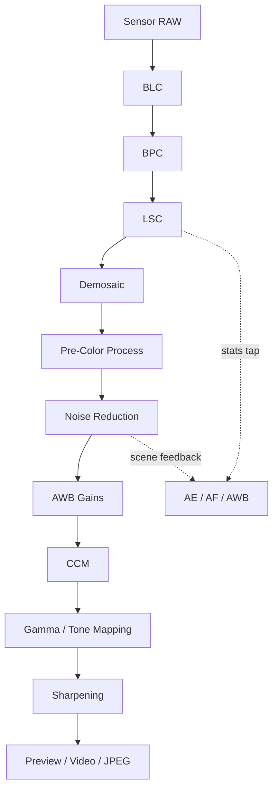
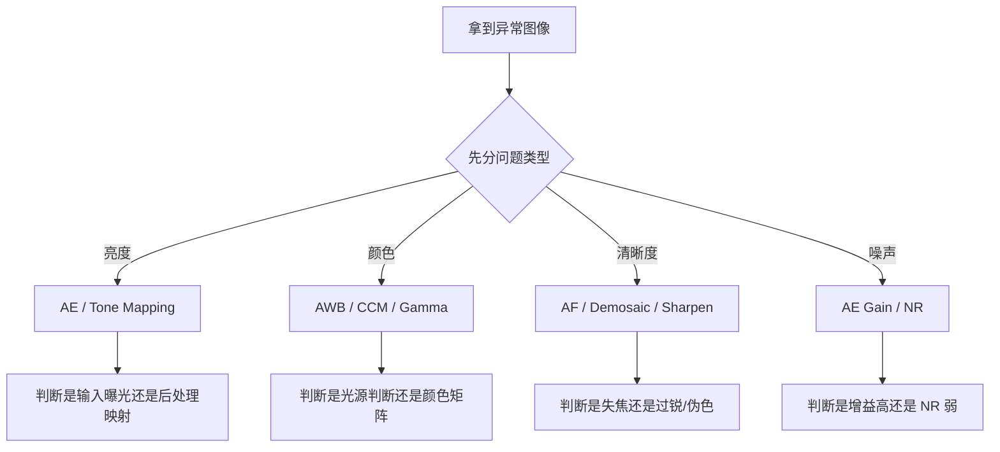

# ISP Flowcharts

## ISP 全流程

```mermaid
flowchart TD
    A["Sensor RAW"] --> B["BLC"]
    B --> C["BPC"]
    C --> D["LSC"]
    D --> E["Demosaic"]
    E --> F["Pre-Color Process"]
    F --> G["Noise Reduction"]
    G --> H["AWB Gains"]
    H --> I["CCM"]
    I --> J["Gamma / Tone Mapping"]
    J --> K["Sharpening"]
    K --> L["Preview / Video / JPEG"]
    D -. stats tap .-> M["AE / AF / AWB"]
    G -. scene feedback .-> M
```

## 图像问题排查

```mermaid
flowchart TD
    A["拿到异常图像"] --> B{"先分问题类型"}
    B -->|亮度| C["AE / Tone Mapping"]
    B -->|颜色| D["AWB / CCM / Gamma"]
    B -->|清晰度| E["AF / Demosaic / Sharpen"]
    B -->|噪声| F["AE Gain / NR"]
    C --> G["判断是输入曝光还是后处理映射"]
    D --> H["判断是光源判断还是颜色矩阵"]
    E --> I["判断是失焦还是过锐/伪色"]
    F --> J["判断是增益高还是 NR 弱"]
```
