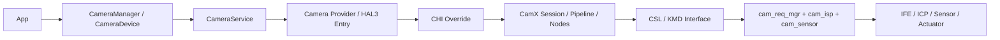
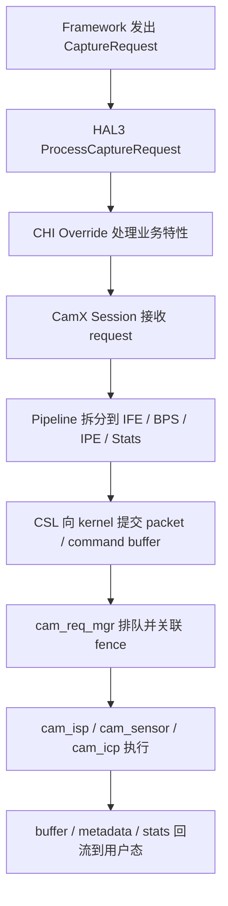
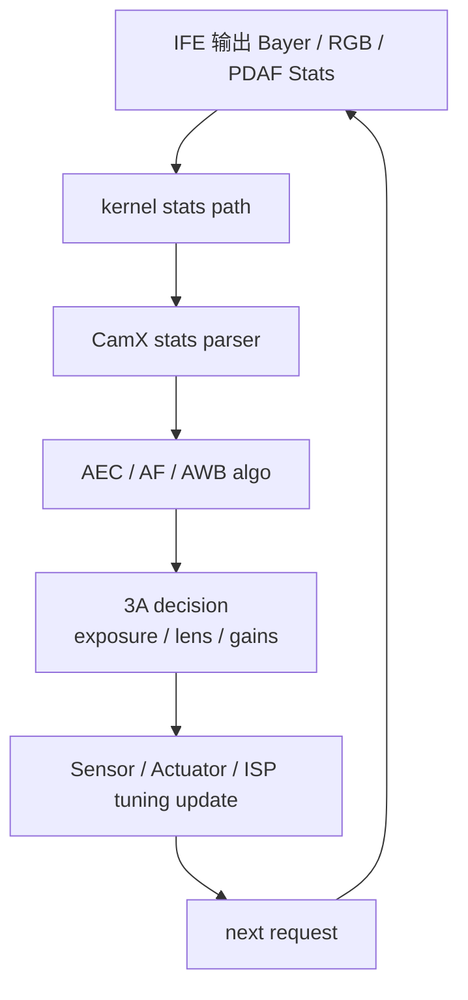

# 高通相机栈源码阅读指南

这份文档的目标不是替代平台源码，而是帮你把 `Android Framework -> Camera HAL -> CHI/CamX -> kernel camera driver -> Sensor/IFE/ICP` 串成一条能真正跟下去的阅读路线。

## 目录

1. [先建立整体认知](#先建立整体认知)
2. [公开源码和常见 BSP 目录怎么对应](#公开源码和常见-bsp-目录怎么对应)
3. [端到端调用链](#端到端调用链)
4. [按场景看源码](#按场景看源码)
5. [3A 和 ISP 在高通栈里的典型落点](#3a-和-isp-在高通栈里的典型落点)
6. [推荐的源码接入方式](#推荐的源码接入方式)
7. [kernel 侧值得先看的文件](#kernel-侧值得先看的文件)
8. [建议的阅读顺序](#建议的阅读顺序)
9. [常用搜索命令](#常用搜索命令)
10. [流程图目录](#流程图目录)

## 先建立整体认知

高通相机栈通常可以粗分成四层：

1. Android Framework 层：应用、`CameraManager`、`CameraService`
2. HAL/用户态层：CHI、CamX、vendor override
3. kernel camera 层：request manager、sensor、IFE、ICP、sync
4. 硬件层：Sensor、VCM、IFE、ICP、JPEG、内存总线

## 公开源码和常见 BSP 目录怎么对应

公开可查的官方入口里，至少可以先对上这两类仓库：

- 官方 CodeLinaro `camx-ext` 仓库：
  [camx-ext](https://git.codelinaro.org/clo/le/platform/vendor/qcom-opensource/camx-ext)
- 官方 CodeLinaro `camera-kernel` 仓库：
  [camera-kernel](https://git.codelinaro.org/clo/la/platform/vendor/opensource/camera-kernel)

实际商用 BSP 里，常见目录通常会更像下面这样：

```text
vendor/qcom/proprietary/chi-cdk/
vendor/qcom/proprietary/camx/
vendor/qcom/proprietary/mm-camera/
drivers/media/platform/msm/camera/
```

可以把它们粗略理解成：

| 常见目录 | 作用 |
|---|---|
| `chi-cdk` | CHI 框架、override、特性扩展 |
| `camx` | HAL3、pipeline、session、node、stats parser、3A 相关逻辑 |
| `mm-camera` | 较老平台常见的用户态 camera 模块 |
| `drivers/media/platform/msm/camera` | kernel camera 驱动 |

说明：

- 不同 SoC、Android 版本、客户 BSP 命名会不同。
- 公开仓和商用 BSP 的目录不一定完全同名，但职责通常能对应上。

## 端到端调用链

### 总览图



### 一次 request 是怎么下去的



### 3A 闭环在高通栈里的位置



## 按场景看源码

### 1. 你想看“预览怎么起来”

建议顺着这条链路：

1. `CameraService` 发起 open 和 configure streams
2. HAL3 入口创建 device / session
3. CHI / CamX 创建 pipeline 和 node graph
4. kernel 侧 request manager 开始接收 request

重点关注关键词：

- `open`
- `configure_streams`
- `process_capture_request`
- `session`
- `pipeline`

### 2. 你想看“3A 为什么会影响成像”

建议顺着这条链路：

1. IFE 统计块输出 stats
2. stats parser 整理成算法输入
3. AEC / AF / AWB 决策
4. 决策结果回写 sensor、actuator、ISP tuning

重点关注关键词：

- `stats parser`
- `AEC`
- `AF`
- `AWB`
- `sensor update`
- `actuator`

### 3. 你想看“为什么这一帧没出图或 metadata 不对”

建议顺着这条链路：

1. `ProcessCaptureRequest`
2. `cam_req_mgr`
3. `sync / fence`
4. `cam_isp_context` 或 `cam_icp_context`
5. buffer done / metadata done 回调

## 3A 和 ISP 在高通栈里的典型落点

### AE

优先跟：

- stats parser 中的亮度统计整理
- AEC 决策逻辑
- sensor exposure apply

### AF

优先跟：

- PDAF / AF stats 解析
- AF state machine
- actuator move

### AWB

优先跟：

- RGB/Bayer stats parser
- light source decision
- AWB gain / CCM 更新

### ISP

优先跟：

- pipeline / node graph
- IFE / BPS / IPE 配置
- tuning / chromatix 下发
- stats tap 和 metadata 回流

## 推荐的源码接入方式

如果你的目标是“把当前学习仓库和高通相机源码一起看”，更推荐用“外部参考仓”方式，而不是把整棵平台源码直接塞进当前仓库。

### 推荐目录结构

```text
Study3AISP/
QcomCameraWorkspace/
  camx-ext/
  camera-kernel/
```

这样做的好处是：

- 当前仓库继续保持轻量，只放学习文档
- 高通源码可以单独切换 tag、branch 和平台版本
- 你用 `rg` 做跨仓搜索时也更方便

### 推荐接入命令

如果你有网络和相应权限，可以把官方公开仓先单独拉到同级目录：

```powershell
git clone https://git.codelinaro.org/clo/le/platform/vendor/qcom-opensource/camx-ext QcomCameraWorkspace/camx-ext
git clone https://git.codelinaro.org/clo/la/platform/vendor/opensource/camera-kernel QcomCameraWorkspace/camera-kernel
```

如果你手里已经有客户 BSP 或内部平台源码，也建议把本仓库和 BSP 放在同级目录，通过搜索和文档互相对照，而不是直接 merge 到一起。

### 接入后怎么和本仓库一起看

建议这样联动：

1. 在本仓库看概念和流程图。
2. 在 `QcomCameraWorkspace` 里用关键词搜索对应入口。
3. 把你确认过的真实函数名、文件路径和问题 case 回填到本仓库文档。

## kernel 侧值得先看的文件

根据 CodeLinaro 公开 `camera-kernel` 树里可见的常见路径，先看下面这些通常很有帮助：

| 路径 | 作用 |
|---|---|
| `drivers/media/platform/msm/camera/cam_req_mgr/cam_req_mgr_core.c` | request manager，串 request、fence、同步和调度 |
| `drivers/media/platform/msm/camera/cam_isp/cam_isp_context.c` | ISP request/context 生命周期 |
| `drivers/media/platform/msm/camera/cam_isp/isp_hw_mgr/cam_ife_hw_mgr.c` | IFE 硬件管理和配置 |
| `drivers/media/platform/msm/camera/cam_sensor_module/cam_sensor/cam_sensor_core.c` | sensor 控制逻辑 |
| `drivers/media/platform/msm/camera/cam_sensor_module/cam_cci/cam_cci_core.c` | CCI/I2C 通道控制 |
| `include/uapi/media/cam_req_mgr.h` | request manager 相关 UAPI |

如果你遇到同步或 buffer 卡住的问题，`cam_req_mgr`、`cam_sync`、`cam_isp_context` 往往是最先值得看的。

## 建议的阅读顺序

### 路线 A：先看系统主干

1. 从 `process_capture_request` 开始。
2. 跟到 `session / pipeline / node`。
3. 再去看 kernel 侧的 `cam_req_mgr` 和 `cam_isp_context`。

### 路线 B：先看 3A

1. 找 `stats parser`。
2. 找 `AEC / AF / AWB` 决策逻辑。
3. 找 `sensor / actuator / tuning` 回写路径。

### 路线 C：先看问题定位

1. 先判断问题更像 AE、AF、AWB 还是 ISP。
2. 再回到对应模块 README。
3. 最后把现象和这一份文档里的源码入口对上。

## 常用搜索命令

如果你本地已经有高通平台源码，建议从这些搜索开始：

```powershell
rg -n "process_capture_request|ProcessCaptureRequest|configure_streams" vendor
rg -n "AEC|AEStats|LuxIndex|Banding|Exposure" vendor
rg -n "AF|PDAF|FocusValue|LensPosition|CAF" vendor
rg -n "AWB|CCT|Tint|AWBGain|LightSource" vendor
rg -n "cam_req_mgr|cam_isp_context|cam_ife_hw_mgr|cam_sensor_core" drivers
```

如果你拿到的是商用 BSP，还可以继续这样缩小范围：

```powershell
rg -n "statsparser|session|pipeline|node|actuator|chromatix" vendor\\qcom
```

## 流程图目录

高通相机栈总流程图放在：

- [images/README.md](./images/README.md)
- [images/flowcharts.md](./images/flowcharts.md)
