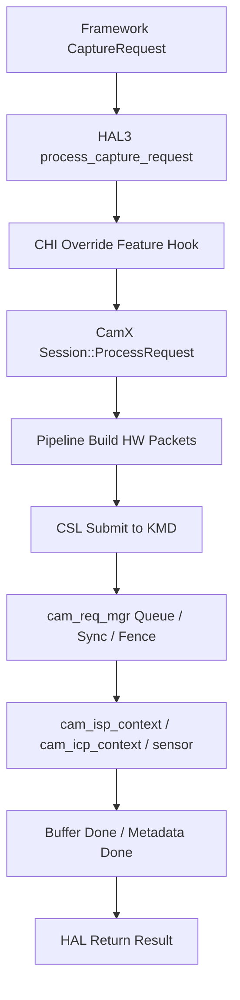
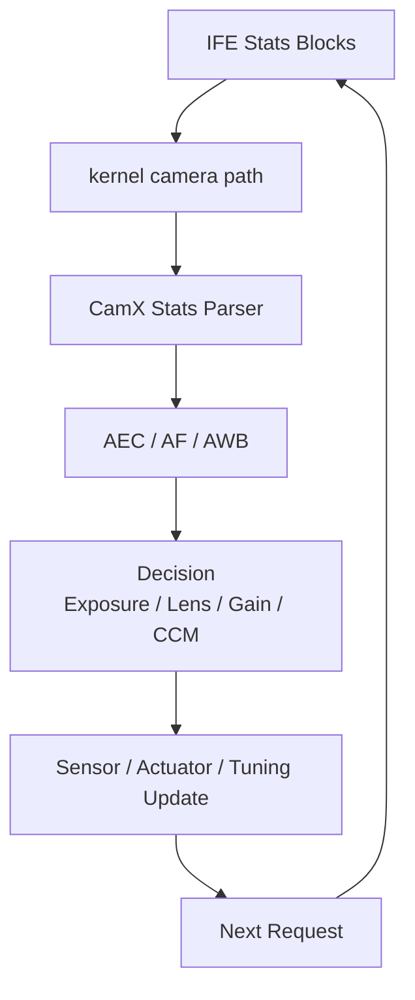
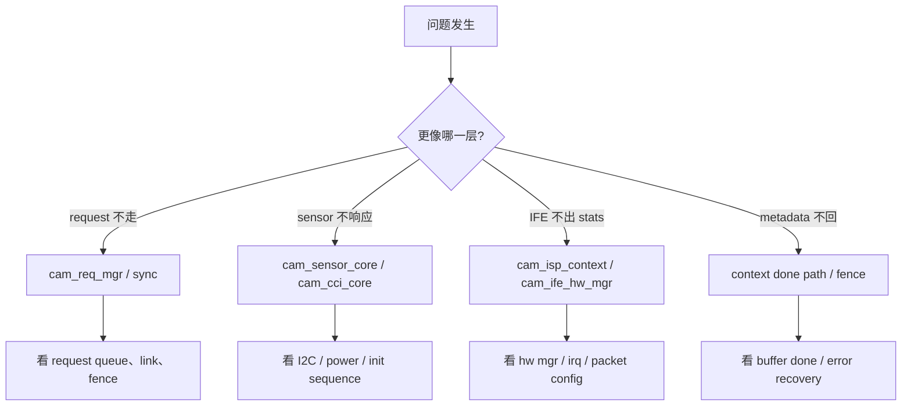

# QCOM Flowcharts

## Android 到高通 Camera Stack 总链路

```mermaid
flowchart LR
    A["Camera App"] --> B["CameraManager / CameraDevice"]
    B --> C["CameraService"]
    C --> D["Provider / HAL3 Entry"]
    D --> E["CHI Override"]
    E --> F["CamX Session"]
    F --> G["Pipeline / Node Graph"]
    G --> H["CSL / Packet Submit"]
    H --> I["cam_req_mgr"]
    I --> J["cam_isp / cam_sensor / cam_icp"]
    J --> K["IFE / ICP / Sensor / Actuator"]
```

## 一次 CaptureRequest 的执行流

```mermaid
flowchart TD
    A["Framework CaptureRequest"] --> B["HAL3 process_capture_request"]
    B --> C["CHI Override Feature Hook"]
    C --> D["CamX Session::ProcessRequest"]
    D --> E["Pipeline Build HW Packets"]
    E --> F["CSL Submit to KMD"]
    F --> G["cam_req_mgr Queue / Sync / Fence"]
    G --> H["cam_isp_context / cam_icp_context / sensor"]
    H --> I["Buffer Done / Metadata Done"]
    I --> J["HAL Return Result"]
```

## 3A 统计闭环

```mermaid
flowchart TD
    A["IFE Stats Blocks"] --> B["kernel camera path"]
    B --> C["CamX Stats Parser"]
    C --> D["AEC / AF / AWB"]
    D --> E["Decision<br/>Exposure / Lens / Gain / CCM"]
    E --> F["Sensor / Actuator / Tuning Update"]
    F --> G["Next Request"]
    G --> A
```

## kernel 问题定位

```mermaid
flowchart TD
    A["问题发生"] --> B{"更像哪一层?"}
    B -->|request 不走| C["cam_req_mgr / sync"]
    B -->|sensor 不响应| D["cam_sensor_core / cam_cci_core"]
    B -->|IFE 不出 stats| E["cam_isp_context / cam_ife_hw_mgr"]
    B -->|metadata 不回| F["context done path / fence"]
    C --> G["看 request queue、link、fence"]
    D --> H["看 I2C / power / init sequence"]
    E --> I["看 hw mgr / irq / packet config"]
    F --> J["看 buffer done / error recovery"]
```
