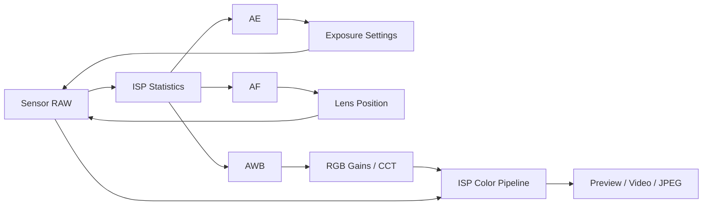

# Study3AISP

这个仓库现在聚焦手机相机里的 `3A + ISP` 学习整理：

- `AE`：自动曝光，解决“亮不亮”
- `AF`：自动对焦，解决“清不清楚”
- `AWB`：自动白平衡，解决“颜色准不准”
- `ISP`：图像信号处理器，负责把 RAW 处理成最终图像

当前仓库还没有接入真实平台源码，主体是学习文档；这次整理会把文档结构、实操路径、图片目录和“源码结合点”都先搭好，方便你后续继续填充。

## 仓库结构

- [AE/README.md](./AE/README.md)：AE 基础、调试重点、实操练习、源码结合点
- [AF/README.md](./AF/README.md)：AF 原理、搜索策略、问题定位、源码结合点
- [AWB/README.md](./AWB/README.md)：AWB 色温估计、色偏分析、实操练习、源码结合点
- [ISP/README.md](./ISP/README.md)：ISP 处理链路、核心模块、画质问题拆解
- [QCOM/README.md](./QCOM/README.md)：高通相机栈源码阅读路线、模块映射和调试入口
- [AE/images/README.md](./AE/images/README.md)：AE 流程图和调试截图目录说明
- [AF/images/README.md](./AF/images/README.md)：AF 流程图和调试截图目录说明
- [AWB/images/README.md](./AWB/images/README.md)：AWB 流程图和调试截图目录说明
- [ISP/images/README.md](./ISP/images/README.md)：ISP 流程图和调试截图目录说明
- [QCOM/images/README.md](./QCOM/images/README.md)：高通相机栈总流程图和源码阅读图

## 3A 和 ISP 的关系

可以先用一张简化链路图建立整体认识：

理解这张图时，先抓住两件事：

1. `3A` 本质上是在做控制闭环。
2. `ISP` 既是图像处理链路，也是很多统计信息的来源。

## 推荐学习顺序

如果你是第一次系统学手机相机，建议按下面顺序看：

1. 先读 [ISP/README.md](./ISP/README.md)，先把整条图像链路搭起来。
2. 再读 [AE/README.md](./AE/README.md)，理解亮度控制。
3. 再读 [AWB/README.md](./AWB/README.md)，理解颜色为什么会偏。
4. 最后读 [AF/README.md](./AF/README.md)，理解清晰度控制和镜头动作。
5. 最后结合 [QCOM/README.md](./QCOM/README.md)，把概念和高通相机栈源码路径对起来。

## 每个模块先看什么

| 模块 | 先关注的问题 | 常见关键字 |
|---|---|---|
| AE | 为什么亮度会变、为什么室内会闪 | `Y`, `linecount`, `gain`, `lux`, `banding` |
| AF | 为什么会拉风箱、低照为什么难合焦 | `FV`, `PDAF`, `lens position`, `CAF` |
| AWB | 为什么会偏黄、偏蓝、偏绿 | `R/G`, `B/G`, `CCT`, `Tint`, `AWB gain` |
| ISP | 为什么噪点多、颜色怪、细节糊 | `BLC`, `LSC`, `Demosaic`, `NR`, `CCM`, `Gamma` |

## 推荐的学习方法

建议按“现象 -> 模块 -> 参数 -> 代码入口 -> 实操验证”的节奏来学：

1. 先描述现象，比如“室内发黄”“逆光脸黑”“视频抽焦”。
2. 再判断更像是 `AE / AF / AWB / ISP` 哪一类问题。
3. 再找对应参数和日志字段。
4. 最后把现象和源码入口对应起来。

## 实操建议

即使现在还没有平台源码，你也可以先用手机专业模式做基础练习：

- 观察不同光照下快门和 ISO 的变化
- 观察不同光源下白纸和肤色的变化
- 观察近景、远景、低纹理场景下 AF 的表现
- 比较 HDR 开关、夜景模式开关后的成像差异

## 后续扩展建议

这个仓库后续很适合继续往下面几个方向扩展：

- 补平台实际 log 字段说明
- 补具体平台源码路径和函数调用链
- 在各模块 `images/` 里补流程图、状态机图、问题案例截图
- 加入真实问题 case study

## 高通相机栈入口

如果你接下来要把 3A / ISP 概念落到高通平台源码里，建议直接看 [QCOM/README.md](./QCOM/README.md)。这份文档把下面几条链路单独串起来了：

- Android App 到 Camera HAL 的调用入口
- CHI / CamX 到 kernel camera driver 的请求路径
- AE / AF / AWB 统计从 IFE 到算法再回写 sensor 的闭环
